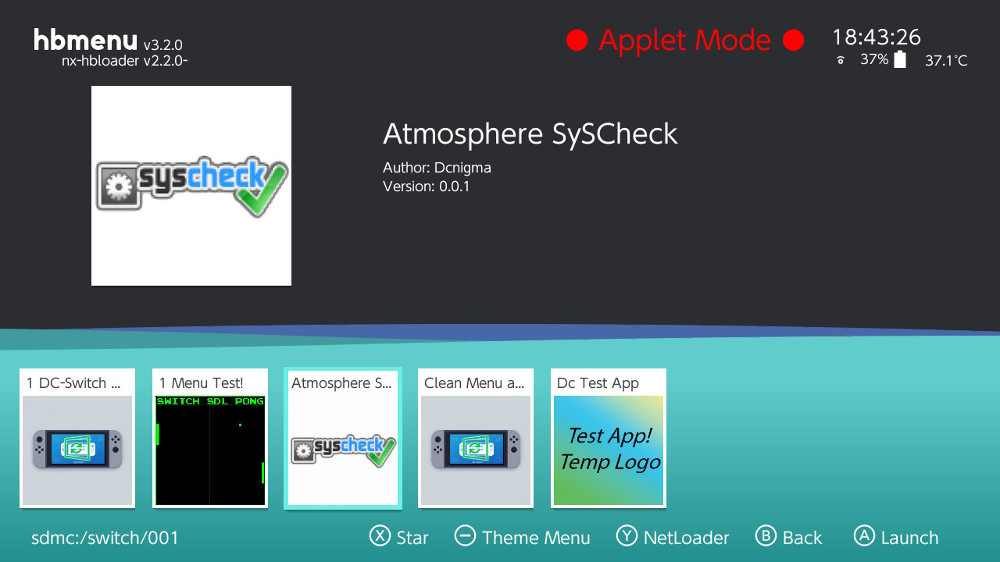
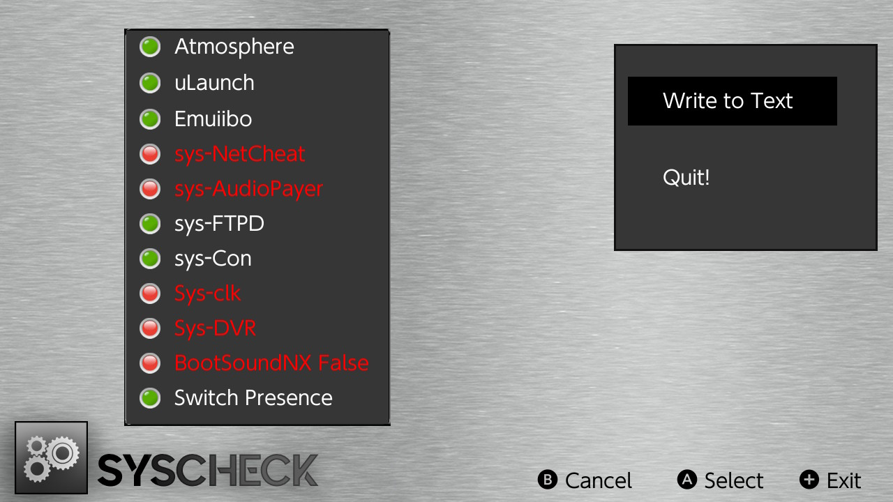
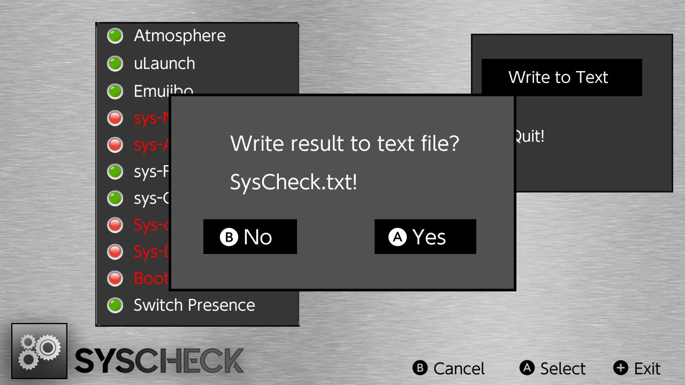
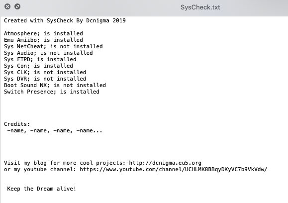

# SysCheck
Just a simple program that checks some folders and gives you a write to TXT output.

  

Before making this I did't know that I have Sys-FTPD installed :-D

But its still in Dev fase need to find out how to write better to a txt.
Got it working by cheating in the code....

But it works..  
SysCheck.txt gets created and holds the right information  
Added ; so you could load it in as a csv..  
    
Plus some self promotion, and the credits will be added soon.  
Need to check this firs :-D sorry guys

Will not release this at this moment because of:  
Since Atmosphère 0.10.1  changed the folders for these programs.  
Atmosphere will move them at start up so the user will not notice.  
  
So its not anymore in titles like in 0.9.4 but in contents,  
I need to rewrite the checks code for 0.10.0 this is a easy fix but still something to do.  
  
And i did't expected this move of Atmosphere..  

Credits: 

Soon...
